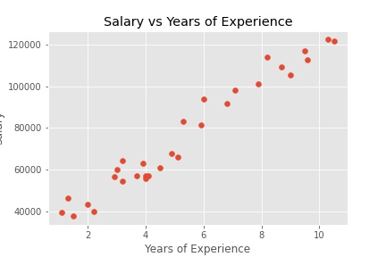
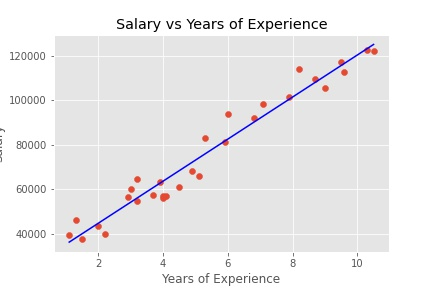

# Linear Regression

Linear Regression is a linear model showing the relationship between x values and y values.

$$
y = mx + b
$$

where 

$y$ = Y cordinates \
$m$ = Slope \
$x$ = X cordinates \
$b$ = Y intercepts

$$
m = \frac{ (\overline{x} \cdot \overline{y}) - \overline{xy}}{ (\overline{x})^2 - \overline{x^2}}
$$

This formula gives us the best fitting line for the data.

Before: \

After: \

